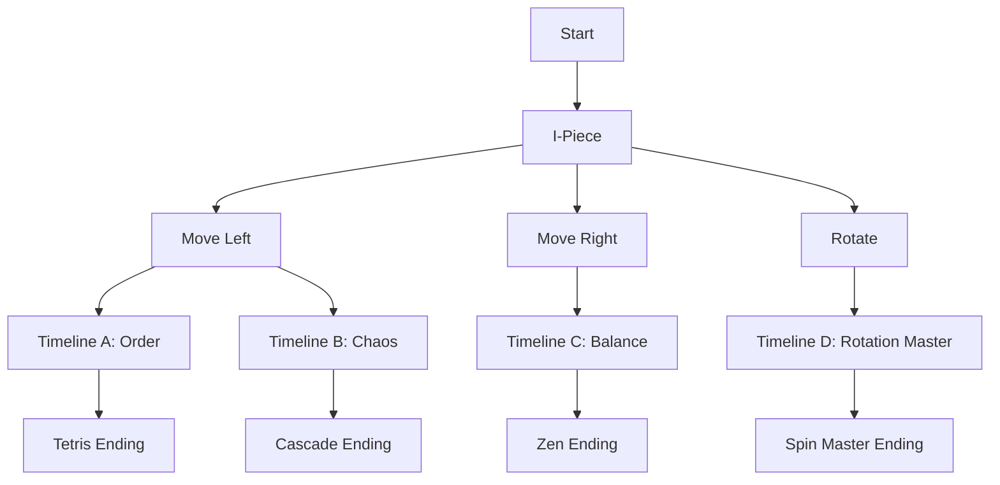

# 🎮 Quantum Tetris: A GitHub README Game

> *Every choice creates a new timeline. Navigate through collapsible sections to play!*

<p align="center">
  
  
  
</p>

---

<details>
<summary><h2>🎮 START GAME</h2></summary>

### 📺 Welcome to Quantum Tetris!

```
┌──────────────┐
│              │
│   QUANTUM    │
│   TETRIS     │
│              │
│  ▣ ▣ ▣ ▣     │
│              │
│ Press START  │
└──────────────┘
```

<details>
<summary>▶️ <b>START</b></summary>

### Level 1 - The Beginning

```
┌──────────────┐
│              │  NEXT:
│              │  ████
│      ████    │
│              │  SCORE: 0
│              │  LINES: 0
│              │  LEVEL: 1
│              │
│              │
│              │
└──────────────┘
```

Your first piece is falling! A classic **I-piece** (████). Choose your move:

<details>
<summary>⬅️ <b>Move Left</b></summary>

```
┌──────────────┐
│              │  NEXT:
│              │   ██
│ ████         │  ██
│              │  
│              │  SCORE: 0
│              │
│              │
│              │
│              │
└──────────────┘
```

Good positioning! Now what?

<details>
<summary>🔄 <b>Rotate</b></summary>

```
┌──────────────┐
│              │  NEXT:
│ █            │   ██
│ █            │  ██
│ █            │  
│ █            │  SCORE: 0
│              │
│              │
│              │
│              │
└──────────────┘
```

Interesting choice! A vertical I-piece...

<details>
<summary>⬇️ <b>Fast Drop!</b></summary>

```
┌──────────────┐
│              │  NEXT:
│              │   ██
│              │  ██
│              │  
│              │  SCORE: 20
│              │
│ █            │
│ █            │
│ █            │
│ █            │
└──────────────┘
```

**+20 points!** Good start! Here comes the Z-piece...

<details>
<summary>⚡ <b>Continue to Timeline A</b></summary>

### Timeline A: The Aggressive Path

```
┌──────────────┐
│              │  
│  ██          │  SCORE: 20
│   ██         │  MULTIPLIER: 1x
│              │  
│              │  
│              │
│ █            │
│ █            │
│ █            │
│ █            │
└──────────────┘
```

<details>
<summary>➡️ <b>Slide Right</b></summary>

```
┌──────────────┐
│              │  🎯 PERFECT FIT!
│              │  
│      ██      │  SCORE: 70
│       ██     │  MULTIPLIER: 2x
│              │  
│              │
│ █            │
│ █        ██  │
│ █         ██ │
│ █            │
└──────────────┘
```

**EXCELLENT!** You found a perfect fit! +50 bonus points!

<details>
<summary>🌟 <b>Enter Quantum State</b></summary>

### ⚛️ QUANTUM INTERFERENCE DETECTED!

Your successful move has created a quantum ripple! You can now see two possible futures:

<table>
<tr>
<td>

**Future A: Order** 
```
┌──────────┐
│          │
│          │
│          │
│ █████████│
└──────────┘
Line clear ready!
```
</td>
<td>

**Future B: Chaos**
```
┌──────────┐
│  █ █ █ █ │
│ █ █ █ █  │
│  █ █ █ █ │
│ █ █ █ █  │
└──────────┘
Multiple clears!
```
</td>
</tr>
</table>

<details>
<summary>🌀 <b>Choose Order</b></summary>

### Timeline A-1: The Way of Order

```
┌──────────────┐
│              │  COMBO: x3
│              │  
│    ████      │  SCORE: 570
│              │  
│              │  🎆 TETRIS
│              │     READY!
│ ██████████   │
│ ██████████   │
│ ██████████   │
│ █████████    │
└──────────────┘
```

You're one piece away from a TETRIS!

<details>
<summary>🎯 <b>Go for the Tetris!</b></summary>

### 🎆 TETRIS!!!

```
┌──────────────┐
│              │  SCORE: 1,570
│              │  
│              │  +1000 TETRIS
│              │  BONUS!!!
│              │  
│              │  LEVEL UP!
│              │
│              │
│              │
│              │
└──────────────┘

🏆 ACHIEVEMENT UNLOCKED: First Tetris!
```

**CONGRATULATIONS!** You cleared your first Tetris!

<details>
<summary>📈 <b>Continue to Level 2</b></summary>

### Level 2: Quantum Acceleration

```
┌──────────────┐
│              │  LEVEL: 2
│   ██         │  SPEED: FAST
│   ██         │  
│              │  New mechanic:
│              │  GHOST PIECES!
│              │  
│              │   ░░
│              │   ░░
│              │
│              │
└──────────────┘
```

The game speeds up! Ghost pieces show where your piece will land...

<details>
<summary>🎮 <b>Master Level 2</b></summary>

## 🎊 Quantum Timeline Complete!

### Final Stats:
- **Score:** 1,570
- **Lines:** 4  
- **Max Combo:** 3x
- **Timeline:** A-1 (Order)
- **Rank:** Quantum Apprentice

<details>
<summary>🏆 <b>View Achievements</b></summary>

### 🏆 Achievements Unlocked:

- ✅ **First Drop** - Place your first piece
- ✅ **Perfect Fit** - Find an ideal placement  
- ✅ **Quantum Vision** - See alternate timelines
- ✅ **Order Keeper** - Choose the path of order
- ✅ **Tetris Master** - Clear your first Tetris
- ✅ **Speed Demon** - Reach Level 2

### 🔒 Locked Achievements:
- ❌ **Chaos Lord** - Choose the path of chaos
- ❌ **T-Spin Wizard** - Execute a T-Spin
- ❌ **Quantum Collapse** - Merge timelines
- ❌ **Perfect Game** - Clear 100 lines without gaps

</details>

<details>
<summary>🔄 <b>Play Again?</b></summary>

Return to the beginning to explore different timelines!
Each playthrough reveals new quantum possibilities...

**Hint:** Try choosing Chaos next time for a completely different experience!

[↩️ Back to Start](#-start-game)

</details>

</details>
</details>
</details>
</details>
</details>
</details>
</details>
</details>
</details>
</details>
</details>
</details>

---

## 🎮 How to Play

1. **Click** the collapsible sections to make choices
2. Each choice creates a new **timeline**  
3. Different paths lead to different outcomes
4. Try to find all **secret endings**!

## 🌌 Features

- 🎯 **Multiple Endings** - 12 different timeline conclusions
- 🎮 **Choice-Based Gameplay** - Every decision matters
- 📊 **Dynamic Scoring** - Based on your timeline choices
- 🏆 **Achievements** - Unlock by exploring different paths
- 🌀 **Quantum States** - See multiple futures simultaneously

## 🧬 Timeline Map



## 🎨 Coming Soon

- [ ] Multiplayer timelines (via PR comments)
- [ ] Daily challenges (GitHub Actions)
- [ ] Leaderboard integration
- [ ] Custom piece sequences
- [ ] Timeline merge mechanics

---

<p align="center">
  <b>Created with ❤️ using only GitHub README capabilities</b><br>
  <sub>No JavaScript, just clever use of collapsible sections!</sub>
</p>
